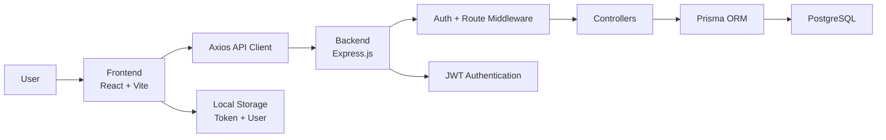

# Smart Blood Donation

A full-stack blood donation coordination system built with a React frontend, an Express backend, and a PostgreSQL database managed through Prisma ORM.

## Project Overview

This application helps blood receivers raise emergency requests and allows donors to register, set availability, and respond to matching requests. The system is organized around a donor-response workflow where emergency requests are created, matched, and tracked through donation records.

## System Architecture

The project follows a 3-tier architecture:

1. Presentation Layer – React frontend
2. Application Layer – Express backend with route controllers and middleware
3. Data Layer – PostgreSQL database accessed via Prisma ORM

### High-Level Architecture Diagram



### Frontend

The frontend is built using React and Vite. It provides the user interface for:

- login and registration
- donor and receiver dashboards
- availability and location updates
- emergency request interaction

### Backend

The backend is an Express.js API that exposes REST endpoints for:

- authentication
- user profile access
- emergency request creation and management
- donor matching
- donation acceptance

### Database and ORM

The application uses Prisma ORM with PostgreSQL. The main domain models are:

- `User`
- `EmergencyRequest`
- `Donation`
- `Notification`

Important relationships include:

- one user can create many emergency requests
- one user can make many donations as a donor
- one emergency request can have many associated donations
- one notification belongs to one user

## Technology Stack

### Frontend

- React 19
- Vite
- React Router DOM
- Axios
- React Icons

### Backend

- Node.js
- Express.js
- Prisma ORM
- PostgreSQL
- JWT
- bcrypt
- CORS

## Project Structure

```text
smart-blood-donation/
├── DBMS-Frontend/        # React application
├── DBMS-Backend/         # Express + Prisma backend
└── README.md             # Project documentation
```

## Run the Project

### Backend

```bash
cd DBMS-Backend
npm install
npm run dev
```

### Frontend

```bash
cd DBMS-Frontend
npm install
npm run dev
```

## Security Notes

- passwords are hashed using bcrypt
- protected routes are secured using JWT middleware
- API requests use bearer token authentication

## Summary

This system is a full-stack blood donation platform that separates concerns cleanly across the frontend, backend, and database layers. It supports donor registration, emergency request handling, and donor matching through a structured REST API and relational database model.
