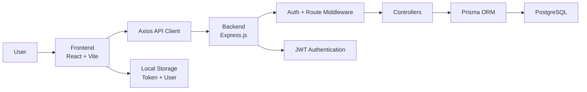
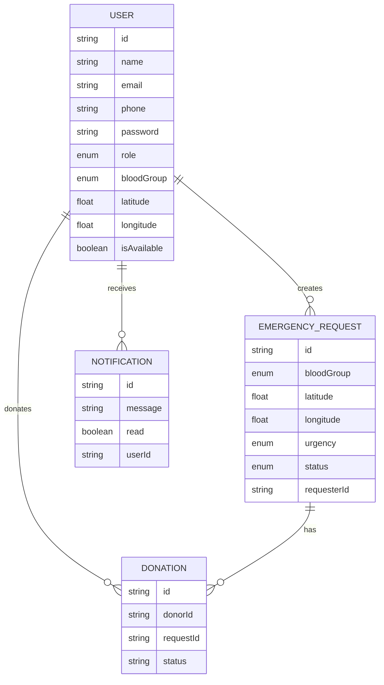
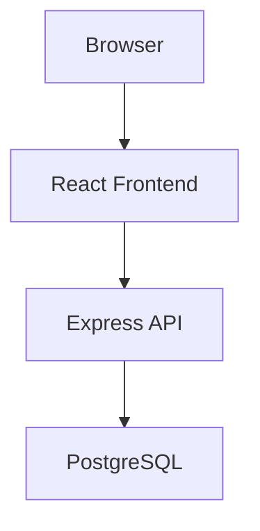

# Smart Blood Donation – Full System Architecture

## 1. Overview

This project is a web-based blood donation coordination system designed to help:

- Blood receivers raise emergency requests
- Donors register and make themselves available
- Matching logic identifies donors by blood group and location/availability
- Donation requests are recorded as formal donation records

The system follows a classic 3-tier architecture:

1. Presentation Layer – React frontend
2. Application Layer – Express backend with controllers and middleware
3. Data Layer – PostgreSQL database managed using Prisma ORM

---

## 2. High-Level Architecture

---

## 3. Frontend Architecture

### Technology Stack

- React 19
- Vite
- React Router DOM
- Axios
- React Icons

### Frontend Responsibilities

- Login / registration pages
- Donor and receiver dashboards
- User authentication state management
- Local session persistence
- API communication to the backend

### Frontend Main Entry Points

- App router and page navigation: `DBMS-Frontend/src/App.jsx`
- Auth provider: `DBMS-Frontend/src/context/AuthContext.jsx`
- Shared API wrapper: `DBMS-Frontend/src/api/axios.js`
- React root renderer: `DBMS-Frontend/src/main.jsx`

### User Experience Workflow

1. User visits the application through the browser.
2. React pages render based on route and auth state.
3. Frontend sends REST requests to the backend API.
4. Auth token is stored locally and reused for protected calls.

---

## 4. Backend Architecture

### Technology Stack

- Node.js
- Express.js
- Prisma ORM
- PostgreSQL
- JWT
- bcrypt
- CORS

### Backend Main Files

- App bootstrap and route registration: `DBMS-Backend/src/app.js`
- Server startup: `DBMS-Backend/src/server.js`
- Prisma client access: `DBMS-Backend/src/database/prisma.js`

### Route Structure

- Auth routes: `/api/auth`
- User routes: `/api/users`
- Emergency routes: `/api/emergency`
- Donation routes: `/api/donations`

### Backend Responsibilities

- User registration and login
- JWT authentication and access control
- Emergency request CRUD
- Donor matching and donor availability updates
- Donation acceptance and linking to requests
- Notification and user profile operations

---

## 5. Domain Model and Data Architecture

The database schema is defined in Prisma and supports the core domain entities:

### Main Models

- `User`
- `EmergencyRequest`
- `Donation`
- `Notification`

### Entity Relationships

### Key Enums

- `UserRole`: DONOR, RECEIVER, ADMIN
- `BloodGroup`: A_POSITIVE, A_NEGATIVE, B_POSITIVE, B_NEGATIVE, AB_POSITIVE, AB_NEGATIVE, O_POSITIVE, O_NEGATIVE
- `RequestStatus`: PENDING, MATCHED, COMPLETED, CANCELLED
- `UrgencyLevel`: LOW, MEDIUM, HIGH, CRITICAL

---

## 6. Request Flow Architecture

### Authentication Flow

1. User submits login/register data from the React frontend.
2. Backend validates credentials and returns a JWT.
3. Frontend stores the token in `localStorage`.
4. Browser sends the token with every subsequent protected request.

### Emergency Creation Flow

1. Receiver logs into the system.
2. Receiver submits emergency details from the frontend.
3. Backend creates a new `EmergencyRequest` record.
4. The request is stored in PostgreSQL through Prisma.

### Matching and Donation Flow

1. Backend queries donors by compatible blood group.
2. Matching donors are filtered by `role = DONOR`, `isAvailable = true`.
3. Donor accepts an emergency request.
4. A `Donation` record is created, linking donor to request.

---

## 7. Security Architecture

### Current Security Measures

- Password hashing using `bcrypt`
- JWT-based protected access
- `Authorization: Bearer <token>` header usage
- Middleware to protect sensitive endpoints

### Security Layering

- Route-level access restriction via middleware
- Controller-level business checks
- DB-level relational constraints through Prisma schema

---

## 8. Deployment and Runtime Model

### Runtime Components

- Frontend runs in browser as a client-side SPA
- Backend runs as a Node.js server
- Database runs as PostgreSQL
- Docker Compose is used to provision supported environment services

### Typical Runtime Topology

---

## 9. Architectural Summary

The project is organized as a full-stack blood donation platform with:

- A React frontend for interaction and dashboards
- An Express API for business logic and secure access
- A PostgreSQL relational database for persistent domain records
- Prisma as the object-relational mapping layer

This creates a clean separation of responsibilities and supports a scalable donor-matching workflow.

---

## 10. Suggested Future Improvements

- Add real-time notifications and push alerts
- Implement geo-distance-based donor matching
- Add transaction protection for duplicate donation creation
- Introduce admin moderation and analytics dashboard
- Add automated API documentation and testing
